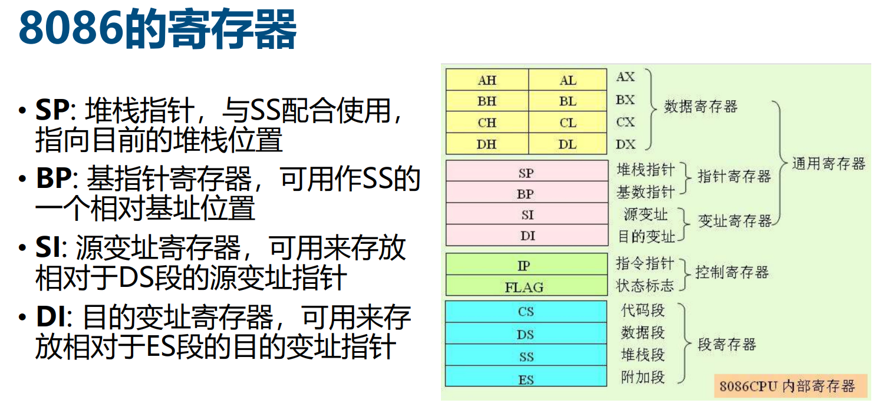

# 配置开发环境

## 安装软件包

- vscode
- Archlinux
- nasm
- bochs

在 Archlinux 上

```console
sudo pacman -S nasm
sudo pacman -S bochs
```

## 补充寄存器知识



## boot.asm

编译

    nasm -f bin boot.asm -o boot.bin

- `-f bin` 是告诉 NASM 生成的输出文件格式为二进制格式，而不是其他格式（如 ELF 或 COFF 格式）。
- `boot.asm` 是需要被编译的汇编语言源文件的文件名。
- `-o boot.bin` 是输出参数，其含义是将编译后的二进制数据输出到 `boot.bin` 文件中。

## 创建硬盘镜像

```bash
bximage -hd=16M -mode=create -sectsize=512 -q myos.img
```

如果输入以上命令失败可以输入`bximage --help`查看bxiamge的提示自行编写命令，也可以命令行输入bximage根据提示创建。

创建后得到的信息如下，mode=flat表示映像文件模式为 flat，即文件中每个扇区直接跟在前一个扇区后面。下面这段信息会用来配置bochsrc文件。

```txt
ata0-master: type=disk, path="master.img", mode=flat
```

## 将 boot.bin 写入主引导扇区

    dd if=boot.bin of=master.img bs=512 count=1 conv=notrunc

bs表示block size一个扇区的大小为512B，count=1表示1个扇区，conv=notrunc表示不截断，如果去掉notrunc的话执行该指令后master.img的大小将变为512B。

## 配置 bochs

    ata0-master: type=disk, path="master.img", mode=flat

```ini
# configuration file generated by Bochs
plugin_ctrl: unmapped=true, biosdev=true, speaker=true, extfpuirq=true, parallel=true, serial=true, iodebug=true, pcidev=false, usb_uhci=false
config_interface: textconfig
display_library: x, options="gui_debug"
memory: host=32, guest=32
romimage: file="/usr/share/bochs/BIOS-bochs-latest", address=0x00000000, options=none
vgaromimage: file="/usr/share/bochs/VGABIOS-lgpl-latest"
boot: disk
floppy_bootsig_check: disabled=0
floppya: type=1_44
# no floppyb
ata0: enabled=true, ioaddr1=0x1f0, ioaddr2=0x3f0, irq=14
ata0-master: type=disk, path="master.img", mode=flat
ata0-slave: type=none
ata1: enabled=true, ioaddr1=0x170, ioaddr2=0x370, irq=15
ata1-master: type=none
ata1-slave: type=none
ata2: enabled=false
ata3: enabled=false
optromimage1: file=none
optromimage2: file=none
optromimage3: file=none
optromimage4: file=none
optramimage1: file=none
optramimage2: file=none
optramimage3: file=none
optramimage4: file=none
pci: enabled=1, chipset=i440fx, slot1=none, slot2=none, slot3=none, slot4=none, slot5=none
vga: extension=vbe, update_freq=5, realtime=1, ddc=builtin
cpu: count=1:1:1, ips=4000000, quantum=16, model=bx_generic, reset_on_triple_fault=1, cpuid_limit_winnt=0, ignore_bad_msrs=1, mwait_is_nop=0
cpuid: level=6, stepping=3, model=3, family=6, vendor_string="AuthenticAMD", brand_string="AMD Athlon(tm) processor"
cpuid: mmx=true, apic=xapic, simd=sse2, sse4a=false, misaligned_sse=false, sep=true
cpuid: movbe=false, adx=false, aes=false, sha=false, xsave=false, xsaveopt=false, avx_f16c=false
cpuid: avx_fma=false, bmi=0, xop=false, fma4=false, tbm=false, x86_64=true, 1g_pages=false
cpuid: pcid=false, fsgsbase=false, smep=false, smap=false, mwait=true
print_timestamps: enabled=0
debugger_log: -
magic_break: enabled=0
port_e9_hack: enabled=0
private_colormap: enabled=0
clock: sync=none, time0=local, rtc_sync=0
# no cmosimage
log: -
logprefix: %t%e%d
debug: action=ignore
info: action=report
error: action=report
panic: action=ask
keyboard: type=mf, serial_delay=250, paste_delay=100000, user_shortcut=none
mouse: type=ps2, enabled=false, toggle=ctrl+mbutton
speaker: enabled=true, mode=system
parport1: enabled=true, file=none
parport2: enabled=false
com1: enabled=true, mode=null
com2: enabled=false
com3: enabled=false
com4: enabled=false
```

如果`bochs -q`失败可能是缺少x库，可以输入命令

```bash
sudo apt install bochs-x
```

