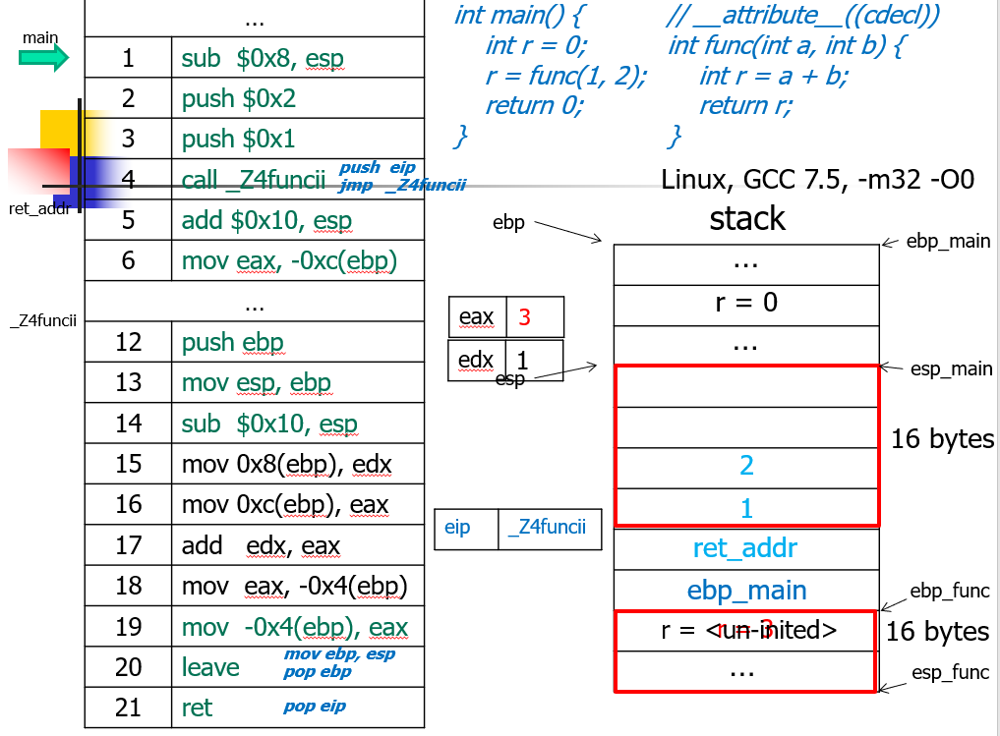
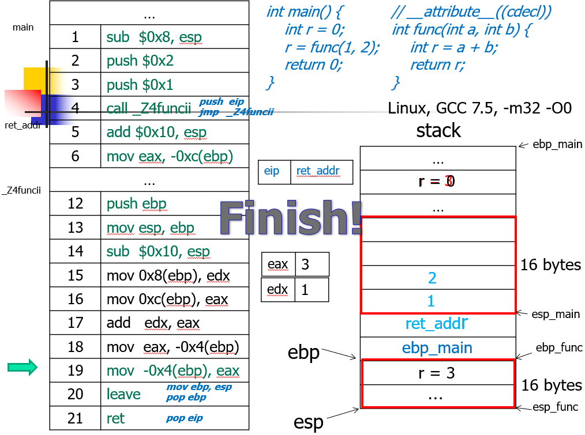
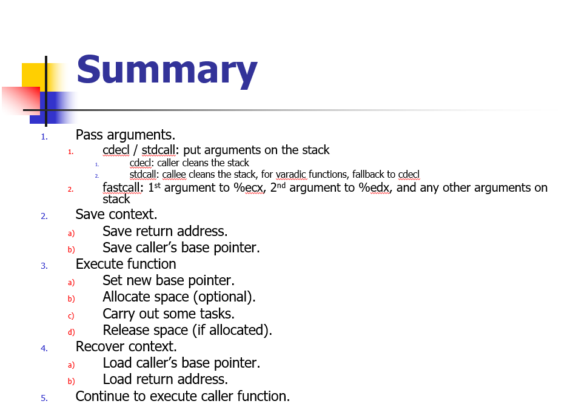

# 局部变量和参数传递

```c++
int add(int x, int y)
{
    int z = x + y;
    return z;
}

int main()
{
    int a = 5;
    int b = 3;
    int c = add(a, b);
    return 0;
}
```

```s
	.file	"params.c"
	.text
	.globl	add
	.type	add, @function
add:
	pushl	%ebp
	movl	%esp, %ebp

	subl	$4, %esp # 一个局部变量
	movl	8(%ebp), %edx # a
	movl	12(%ebp), %eax # b
	addl	%edx, %eax # eax += edx
	movl	%eax, -4(%ebp) # z = x + y;
	movl	-4(%ebp), %eax # eax = z;

	leave
	ret
	.size	add, .-add
	.globl	main
	.type	main, @function
main:
	pushl	%ebp
	movl	%esp, %ebp # 保存栈帧

	subl	$12, %esp # 保存 12 个字节，有三个局部变量
	movl	$5, -12(%ebp) # a
	movl	$3, -8(%ebp) # b

	pushl	-8(%ebp) # b
	pushl	-12(%ebp) # a
	call	add # 调用
	addl	$8, %esp # 恢复栈

	movl	%eax, -4(%ebp) # c = add(a, b);
	movl	$0, %eax # 返回值存储在 eax 寄存器中

	leave # 恢复栈帧
	ret # 函数返回
	.size	main, .-main
	.section	.note.GNU-stack,"",@progbits
```

## 函数调用

参数从右向左压入栈中。







## 栈帧

保存函数局部变量的信息，可以用于回溯调用函数；

## 栈保护

canary 

## 寄存器传递参数

    `printf` // 支持可变参数（只能使用堆栈来传递）
