# 进入用户模式

## 任务特权级环

## 任务状态段

- ss0
- esp0

## 中断门处理过程

如果处理程序运行在低特权级，那么栈切换（从低特权级切换到高特权级）就会发生：

- 内核特权级的 栈段选择子 和 栈顶指针 将会从当前的 TSS 段中获得，在内核栈中将会压入用户态的 栈段选择子 和 栈顶指针；
- 保存当前的状态 eflags, cs, eip 到内核栈
- 如果存在错误码的话，压入错误码

如果处理器运行在相同的特权级，那么相同特权级的中断代码将被执行：

- 保存当前的状态 eflags, cs, eip 到内核栈
- 如果存在错误码的话，压入错误码

## 进入用户模式

进入用户态需要模拟中断返回，假设中断发生，现在处理完要返回到用户态。

- 内核栈 Return Oriented Programming 
- 用户栈
- 中断返回

内核中断上下文，下图是内核栈

下图是用户态发生中断

如果不理解上面的内容可以看一下博客[内核栈和用户栈](https://blog.csdn.net/qq_41727218/article/details/88531917)，先压入中断上下文的寄存器，再将任务切换ABI调用约定的那五个寄存器（ebx,esi,edi,ebp,esp）压栈。当使用IRET指令返回到一个不同的保护级别时，IRET不仅会从堆栈弹出以上内容，还会弹出堆栈段选择子及堆栈指针分别到SS与SP寄存器。

## 参考文献

1. <https://wiki.osdev.org/TSS>
2. Intel® 64 and IA-32 Architectures Software Developer's Manual Volume 3 Chapter 6 Interrupt and Exception Handling
3. [郑刚 / 操作系统真象还原 / 人民邮电出版社 / 2016](https://book.douban.com/subject/26745156/)
