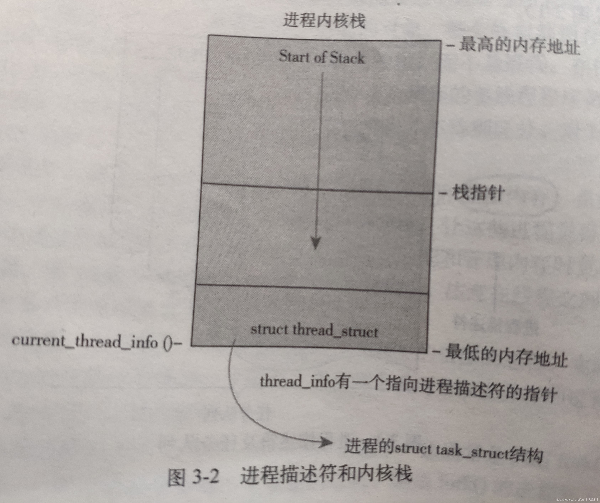

# 内核栈和用户栈

内核在创建进程的时候创建进程控制块以及进程的堆栈。**每个进程有两个栈：用户栈、内核栈**

用户栈在用户地址空间中，内核栈在内核地址空间中。

## 用户栈

用户栈不难理解，用户栈是用户空间中的一块区域，用于保存用户进程的子程序间相互调用的参数、返回值以及局部变量等信息。在linux系统中，用户栈的大小一般为8M。可以通过ulimit -s来手动设置。

## 进程用户栈和内核栈的切换

当进程由于中断或系统调用从用户态转换为内核态时，进程所使用的栈也要从用户栈切换到内核栈。系统调用实质就是通过指令产生中断（软中断）。进程由于中断而陷入到内核态，进程进入内核态之后，首先把用户态的堆栈地址保存在内核态堆栈中，然后设置堆栈寄存器地址为内核栈地址，这样就从用户栈转换成内核栈。如果由外层向内层转移时，需要从当前 `TSS` 中取出内层 `ss` 和 `esp` 作为目标代码的 `ss` 和 `esp`

当进程从内核态转换到用户态时，将堆栈寄存器的地址再重新设置成用户态的堆栈地址（即终端前进程在用户态执行的位置），这一过程也成为现场恢复。可以在准备就绪之后**跳转到中断处理程序的后半部分**，假装发生了一次时钟中断来启动进程 `A` ，利用 `iret` 来实现 `ring0` 到 `ring1` 的转移。

## 内核栈

通过上述过程不难发现一个问题：用户态陷入到内核态时，需要在内核栈保存用户栈的地址，那么在进入内核态时，去哪里找内核栈指针呢？

首先我们需要明确一点：**每当进程从用户态切换到内核态时，内核栈总是空的。**当进程在用户态执行时，使用的是用户栈，切换到内核态运行时，内核栈保存的时进程在内核中运行的相关信息。重回到用户态时，内核栈中保存的信息全部恢复，因此，进程从内核态切换到用户态时，内核栈总是空的。

弄清楚了每次进程切换到内核态时内核栈总是空的，那上述问题就很好解决了，用户态切换到内核栈时，因为内核栈是空的，只需将栈寄存器值设置成内核栈栈顶指针即可，那么下边我们通过内核栈的实现来理解如何获得内核栈的栈顶指针。

## 内核栈的实现

以linux内核为例，内核在创建进程时，首先需要给进程分配task_struct结构体，在做这一步的时候内核实际上分配了两块连续的物理空间（一般是1个物理页），上边供堆栈使用，下边保存进程描述符task_struct。这个整体叫做进程的内核栈，因此task_struct是在进程内核栈内部的，如下图：

当为内核栈分配地址空间的时候，分配一个页面（这里以4k为例）返回的地址是该该页面的低地址，而栈是由高地址向低地址增长的，由上图所示：**栈顶指针只需将该内核栈的首地址+4k即可**